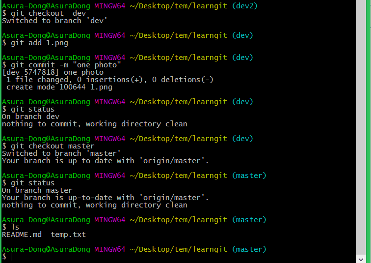
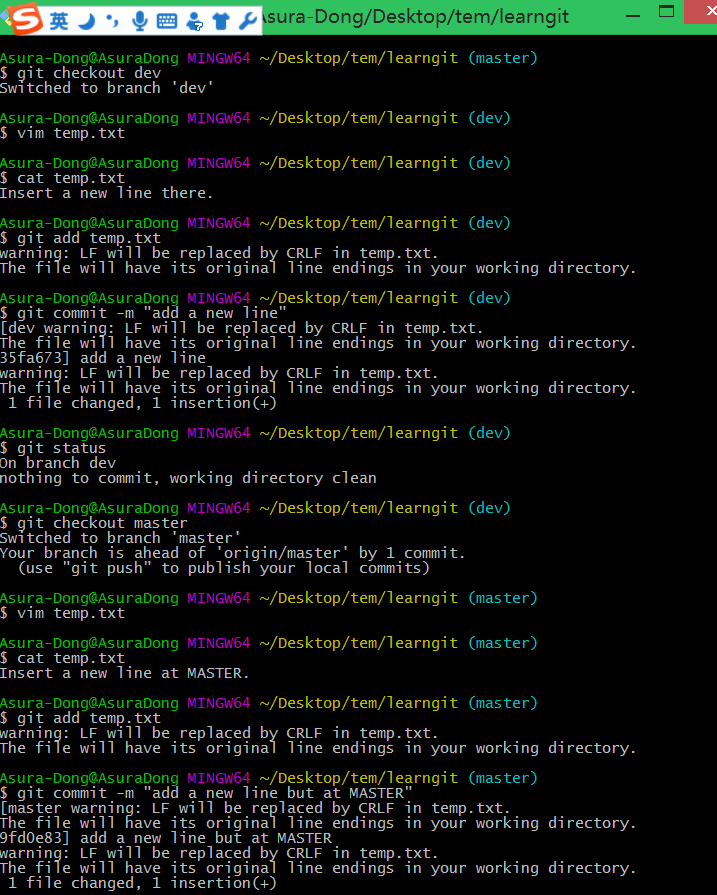

[toc]

## 了解分支

如果想实现多人协作、划出Bug区、Feature区等功能，就需要**分支功能**。（确实很强大的地方）

每次`commit`时，Git都把它们串成一条时间线，这条时间线就是一个**分支**。截止到目前，只有一条时间线，在Git里，这个分支叫主分支，即`master`分支。而此时`HEAD`也指向`master`。

每次提交，`master`分支都会向前移动一步，这样，随着你不断提交，`master`分支的线也越来越长。

当我们创建新的分支`dev`的时候，将`HEAD`指向`dev`，这时候就在`dev`分支上了。

## 创建和进入分支

创建分支：`git branch 分支名字`

进入分支：`git checkout 分支名字`

创建并且进入分支：`git checkout -b 分支名字` 

如果想查看当前在哪个分支：`git branch`

## 合并分支

如果在`dev`分支下提交一张照片，此时，工作区是有照片的（在文件夹查看）。然后切换到`master`分支，会发现本地的工作区被刷新了一下，然后图片不见了。在命令行`ls`查看文件列表也没有图片（如截图所示）。**此时，需要将`dev`分支合并到`master`分支**。

合并分支：`git merge 分支名字`。将分支合并到当前分支。这时可以发现，照片出现了。（附截图）

注意到上面的Fast-forward信息，Git告诉我们，这次合并是“快进模式”，也就是直接把`master`指向`dev`的当前提交，所以合并速度非常快。当然，也不是每次合并都能Fast-forward。

如果加上`--no-ff`参数就是**普通合并模式**。这样就保留了历史信息。

## 解决分支冲突

如果两个或多个分支对同一文件作出不同的操作，合并的时候就会有**冲突**。
如下面截图先在`dev`中修改txt，再在`master`中作出不同的修改。

此时，`git merge dev`就会报错，提醒有冲突，**需要手动解决**

当然，也可以通过`git status`查看，会发现`both modified`的错误提示。或者`cat temp.txt`，不同分支的修改的不同之处被标注了出来。

在当前分支修改文件内容并且再次提交修改，即可以解决冲突。

## 删除分支

一条命令：`git branch -d 分支名字`即可删除

如果分支还未合并到当前分支：`git branch -D 分支名字` 强制删除。

## 团队协作（分支策略）

在实际开发中，我们应该按照几个基本原则进行分支管理：

1. 首先，`master`分支应该是非常稳定的，也就是仅用来发布新版本，平时不能在上面干活；

2. 那在哪干活呢？干活都在`dev`分支上，也就是说，`dev`分支是不稳定的，到某个时候，比如1.0版本发布时，再把`dev`分支合并到`master`上，在`master`分支发布1.0版本；

3. 你和你的小伙伴们每个人都在dev分支上干活，每个人都有自己的分支，时不时地往`dev`分支上合并就可以了

4. 最后发布时，再将`dev`合并到`master`

***

> 欢迎进一步交流本博文相关内容： 
GitHub地址 ：<https://github.com/AsuraDong/Blog> 
CSDN地址 : <http://blog.csdn.net/asuradong> 
简书地址：<http://www.jianshu.com/u/d1570f4a618a> 
博客园地址 : <http://www.cnblogs.com/AsuraDong/>(不一定及时更新) 
也可以致信进行交流 : <xiaochiyijiu@163.com>  
欢迎关注个人微博：<http://weibo.com/AsuraDong> 
**欢迎转载** , 但*请指明出处  :  )*

***
