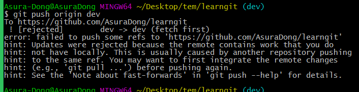
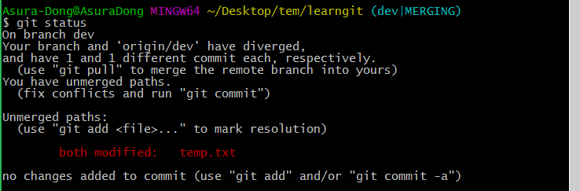
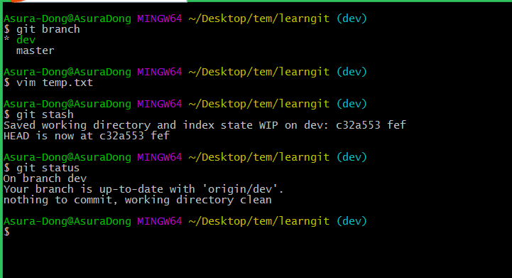
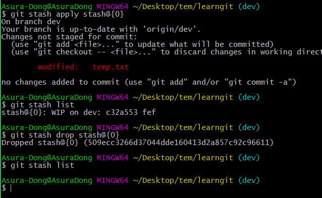

[toc]

## GitHub上的团队协作

### 远程信息

`git remote`:查看远程库的信息

`git remote -v`：查看远程库的详细信息

### 推送分支

`git push origin 要推送的分支`：比如`git push origin dev`是向服务器推送dev分支。而我们熟悉的`git push origin master`就是向远程推送master分支。

假设有一个分支`bug_dev`专门用来修复bug，就不需要推送了，只要自己留着就可以了（除非要别人帮助修复）。**其他的分支要根据功能来决定是否推送。**

*关于`-u`参数等其他方面可以看之前的博文*。

### 抓取分支

如果直接从远程仓库`clone`到本地的文件中，那么只会有`master`分支。

如果想获得`dev`分支到本地，需要：`git checkout -b dev origin/dev`。就是把`origin`上的`dev`分支get到本地，并且名字为`dev`。

此时，我在本地的两个文件夹中的`dev`分支分别对同一个文本文件做了相同修改，当1号文件夹push成功后，再push二号文件夹就失败了。

出现如截图所示的情况。此时，应该：
1. `git branch --set-upstream dev origin/dev`：指定本地`dev`分支与远程`origin/dev`分支的链接
2. `git pull`:`把最新的提交从origin/dev抓下来`
3. 此时出现了之前的合并分支冲突的情况（如下截图），解决方式和之前一样，最后再提交就可以了。

***

## Feature分支

> 类似于项目代码的一个功能，后来决定不要了，你刚好还没开发完，那就直接把这个分支删除了（不需要再合并）：`git branch -D 分支名字`

***

## Bug分支

> 如果在一个分支上工作但没有完成，还需要临时区别的分支修复bug时候。需要保存下来，尽量别提交，否则队友可能被你的不完善的代码坑掉。

`git stash`:隐藏当前的工作现场（如截图），status的结果是clean！！！

`git stash list`:查看所有隐藏

`git stash apply stash的id`：恢复

`git stash drop stash的id`:apply恢复后并没有`git list`中删除，所以用这条命令其中stash的内容删除。（如截图）

***

> 欢迎进一步交流本博文相关内容： 
GitHub地址 ：<https://github.com/AsuraDong/Blog> 
CSDN地址 : <http://blog.csdn.net/asuradong> 
简书地址：<http://www.jianshu.com/u/d1570f4a618a> 
博客园地址 : <http://www.cnblogs.com/AsuraDong/>(不一定及时更新) 
也可以致信进行交流 : <xiaochiyijiu@163.com>  
欢迎关注个人微博：<http://weibo.com/AsuraDong> 
**欢迎转载** , 但*请指明出处  :  )*

***
