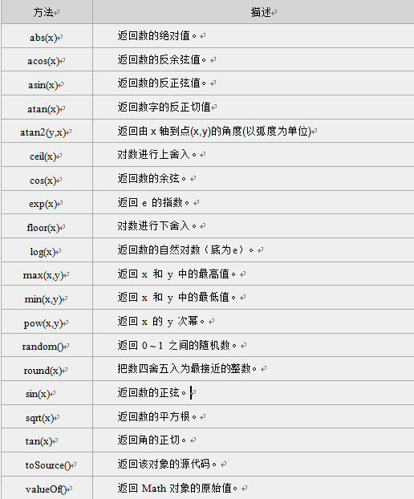
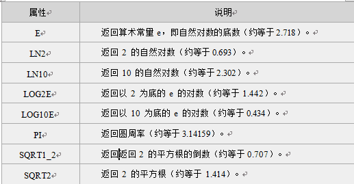
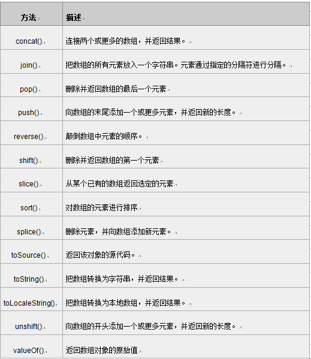

[toc]
### 1. Date对象

#### 初始化：
- 默认:
    ```javascript
    var d = new Date();
    ```

- 带日期：
    ```javascript
    var d = new Date(2012, 10, 1);  //2012年10月1日
    var d = new Date('Oct 1, 2012'); //2012年10月1日
    ```

#### 属性方法：


- `getDay()`：返回星期，返回的是0-6的数字，0 表示星期天。
- `new Date("2017,1,1"); `:**如你所想，初始化方法**
- `new Date("2017/12/1,12:20:12");` : 一种**精确到秒**的初始化方法

### 2. 字符串对象
#### 初始化：
`var mystr = "I love JavaScript!"`

#### 属性方法

- `mystr.length`:长度
- `toUpperCase()`
- `charAt(index)`:charAt() 方法可返回指定位置的字符。返回的字符是长度为 1 的字符串。
- `indexOf(substring, startpos)`:第一个参数必选。返回指定的字符串首次出现的位置
- `split(separator,limit)`: 方法将字符串分割为字符串数组，**并返回此数组。**。第一个参数是`""`时，直接切割；第二参数是切割次数
- `substring(startPos,stopPos)/substr(startPos,length)`:提取字符串

### 3. Math对象

#### 实例：
```html
<script type="text/javascript">
  var mypi=Math.PI; 
  var myabs=Math.abs(-15);
  document.write(mypi);
  document.write(myabs);
</script>
```

#### 方法


[toc]
#### 属性



### 4.Array对象

#### 属性方法



- `concat(array1,array2,...,arrayN)`:此方法返回一个新数组，不改变原来的数组。
- `arrayObject.join(分隔符)`:不同于`Python`的join
- `slice(start,end)`:可从已有的数组中返回选定的元素。

#### `sort()`排序函数
使用： `arrayObject.sort(方法函数)`

如果没有方法函数，默认是按照array中的元素的ASCII码排序的。

**所以，如果想按顺序排序，需要定义一个两个参数的函数，返回值是大于、小于或等于0.**

实例：
```html

<!DOCTYPE html>
<html>
<head>
<meta http-equiv="Content-Type" content="text/html; charset=utf-8" />
<title>Array对象 </title>
<script type="text/javascript">
   function sortNum(a,b) {
        return a<b
   }
var myarr = new Array(80,16,50,6,100,1,2);
document.write(myarr.sort(sortNum));
</script>
</head>
<body>
</body>
</html>
```