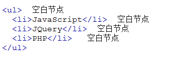

[toc]

一些补充（不知道放在哪里、、、）：
1. `node.className`：指定节点的class
2. `document.body.appendChild()`:可以访问body节点
3. `liNode.checked`:检查是否被选中(true)
4. `window.onload = function(){...}`：在document加载完成后调用`window.onload`


## 一、初识DOM
> 文档对象模型DOM（Document Object Model）定义访问和处理HTML文档的标准方法。DOM 将HTML文档呈现为带有元素、属性和文本的树结构（节点树）

1. 元素节点：上图中`<html>`、`<body>`、`<p>`等都是元素节点，即标签。
2. 文本节点:向用户展示的内容，如`<li>...</li>`中的JavaScript、DOM、CSS等文本。
3. 属性节点:元素属性，如`<a>标签的链接属性href="http://www.imooc.com"`。

## 二、获得节点

1. `getElementsByName("classname")`：有属性length，类似数组访问
2. `getElementsByTagName("tagname")`:有属性length，类似数组访问
3. `getElementById("id")`：根据id，所以一定只有一个

#### 获得/修改节点的属性值
- `node.getAttribute(name);`:直接`node.name`也可以
- `node.getAttribute(name,value);`：或者`node.name=value;`

## 三、节点属性

#### nodeName 属性: 节点的名称，是只读的。
    1. 元素节点的 nodeName 与标签名相同
    2. 属性节点的 nodeName 是属性的名称
    3. 文本节点的 nodeName 永远是 #text
    4. 文档节点的 nodeName 永远是 #document
#### nodeValue 属性：节点的值
    1. 元素节点的 nodeValue 是 undefined 或 null
    2. 文本节点的 nodeValue 是文本自身
    3. 属性节点的 nodeValue 是属性的值
#### nodeType 属性: 节点的类型，是只读的。以下常用的几种结点类型:
**如下所示：**

元素类型   | 节点类型
 - | -
元素       |   1
属性        |  2
文本        |  3
注释         | 8
文档        |  9

## 四、亲戚节点
### 1. 子节点
> `elementNode.childNodes`,返回的值可以看作是一个数组，他具有length属性。

**注意:**
1. IE全系列、firefox、chrome、opera、safari兼容问题
2. 节点之间的空白符，在firefox、chrome、opera、safari浏览器是文本节点，所以IE是3，其它浏览器是7，如下图所示:




### 2. 第一个/最后一个子节点
`node.firstChild/lastChild`

### 3. 父亲节点
`node.parentNode`

### 4. 兄弟节点
- 之前紧跟的节点:`node.previousSibling`
- 之后紧跟的节点:`node.nextSibling`

## 五、操作节点
### 1.创建元素节点和文本节点
- `createElement(tagName)`方法可创建元素节点。此方法可返回一个 Element 对象。
- `createTextNode(data)` 方法创建新的文本节点，返回新创建的 Text 节点：**也可以用`node.innerHTML`来代替**

### 2.插入节点
- `appendChild(newnode)`:在指定节点的最后一个子节点列表之后添加一个新的子节点.
- `insertBefore(newnode,node);`:方法可在已有的子节点前插入一个新的子节点。
    ```javascript
    <script type="text/javascript">

    var otest = document.getElementById("test");  
    var newnode = document.createElement("li");
    newnode.innerHTML = "php";
    
    otest.insertBefore(newnode,otest.lastChild);
    </script>
    ```
### 3.删除节点
`node.removeChild(node)`: 方法从子节点列表中删除某个节点。如删除成功，此方法可返回被删除的节点，如失败，则返回 NULL。

### 4.替换节点
- `node.replaceChild (newnode,oldnew )`:replaceChild 实现子节点(对象)的替换。返回被替换对象的引用。 
    ```html
    <script type="text/javascript">
        function replaceMessage(){
            var oldnode=document.getElementById("oldnode");
            var newnode=document.createElement("i");
            newnode.innerHTML=oldnode.innerHTML
            oldnode.parentNode.replaceChild(newnode,oldnode);
        }    
    </script>
    ```

<hr/>

## 六、实战

### 1. 增添表格
```html
<!DOCTYPE html>
<html>
 <head>
  <title> new document </title>  
  <meta http-equiv="Content-Type" content="text/html; charset=utf-8"/>   
  <script type="text/javascript"> 
	 // 编写一个函数，供添加按钮调用，动态在表格的最后一行添加子节点；
     var num = document.getElementsByTagName("tr").length;

     function add(){
        num++;
        let tr = document.createElement("tr");
        let td_id = document.createElement("td");
        let td_name =  document.createElement("td");
        var td_del = document.createElement("td");
        td_id.innerHTML = "xh00"+num;
        td_name.innerHTML = "第"+num+"名学生";
        td_del.innerHTML = "<a href='javascript:;' onclick='del(this)' >删除</a>";
        let table = document.getElementById("table");
        tr.appendChild(td_id);
        tr.appendChild(td_name);
        tr.appendChild(td_del);
        table.appendChild(tr);
     }
			
     // 创建删除函数
     function del(obj)
     {
         let tr = obj.parentNode.parentNode;
         tr.parentNode.removeChild(tr);
     }
  </script> 
 </head> 
 <body> 
	   <table border="1" width="50%" id="table">
	   <tr>
		<th>学号</th>
		<th>姓名</th>
		<th>操作</th>
	   </tr>  

	   <tr>
		<td>xh001</td>
		<td>王小明</td>
		<td><a href="javascript:;" onclick="del(this);">删除</a></td>   <!--在删除按钮上添加点击事件  -->
	   </tr>

	   <tr>
		<td>xh002</td>
		<td>刘小芳</td>
		<td><a href="javascript:;" onclick="del(this);">删除</a></td>   <!--在删除按钮上添加点击事件  -->
	   </tr>  

	   </table>
	   <input type="button" value="添加一行" onclick="add()" />   <!--在添加按钮上添加点击事件  -->
 </body>
</html>
```

### 2.切换页面

**HTML代码：**
```html
<!DOCTYPE html>
<html>
    <head>
        <meta charset="utf-8"/>
        <title>练习题</title>
        <link rel="stylesheet" href="demo.css"/>
        <script type="text/javascript" src="demo.js"></script>
    </head>
    <body>
        <div id="test">
            <ul>
                <li class="on">房产</li>
                <li>家居</li>
                <li>二手房</li>
            </ul>
            <p class="on">
                275万购昌平邻铁三居 总价20万买一居<br>
                200万内购五环三居 140万安家东三环<br>
                北京首现零首付楼盘 53万购东5环50平<br>
                京楼盘直降5000 中信府 公园楼王现房<br>
            </p>
            <p class="hide">
                40平出租屋大改造 美少女的混搭小窝<br>
                经典清新简欧爱家 90平老房焕发新生<br>
                新中式的酷色温情 66平撞色活泼家居<br>
                瓷砖就像选好老婆 卫生间烟道的设计<br>
            </p>
            <p class="hide">
                    通州豪华3居260万 二环稀缺2居250w甩<br>
                    西3环通透2居290万 130万2居限量抢购<br>
                    黄城根小学学区仅260万 121平70万抛!<br>
                    独家别墅280万 苏州桥2居优惠价248万<br>
            </p>
        </div>
    </body>
</html>
```

**CSS代码**
```css
* {
    padding:0;
    margin:0;
}

#test{
    background: #0DA07D;
    width:20%;
    margin:0 auto;
}

.hide{
    display: none; 
    /* 隐藏，且不占据原来的位置 */
}

.on{
    background:#35DF2B;
}

ul {
    list-style: none;
    overflow: hidden;
    text-align: center;
}

li {
    float: left;
    display: block;
    width:33.3333333333%;
    font-weight: bolder;
}

    li:hover{
        cursor: pointer;
    }

```

**JS脚本代码**
```javascript
function changePage(){
    let test = document.getElementById("test");
    let li_arr = document.getElementsByTagName("li");
    let p_arr = document.getElementsByTagName("p");
    for(let i = 0;i<li_arr.length;++i){
        li_arr[i].index = i;
        li_arr[i].onmouseover = function(){
            for(let n=0;n<li_arr.length;++n){
                li_arr[n].className = "";
                p_arr[n].className ="hide";
            }
            this.className = "on";
            p_arr[this.index].className = "on";
        }
    } 
}

window.onload = changePage;
```