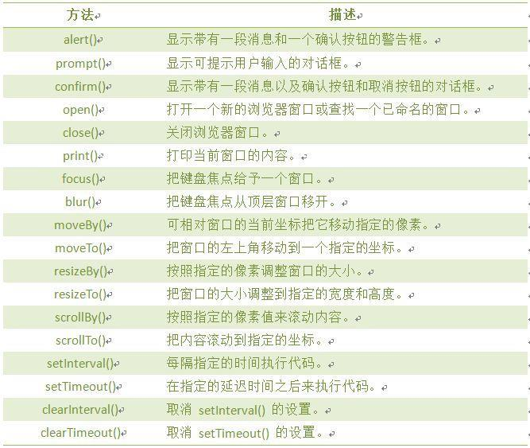
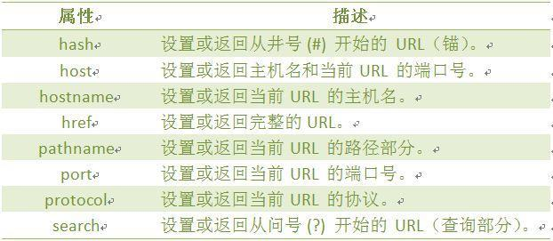
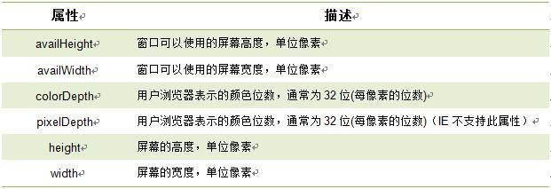

[toc]
## window对象
> window对象是BOM的核心，window对象指当前的浏览器窗口。

### window对象方法:



### 一、JavaScript计时器

HTML代码：
```html
<body>
    北京时间：<input type="text" id="clock" readonly>
</body>
```


- 计时器类型：
    1. 一次性计时器：仅在指定的延迟时间之后触发一次。
    2. 间隔性触发计时器：每隔一定的时间间隔就触发一次。


- `setInterval(代码,交互时间);`
    ```html
    <script>
    // 计时器
    var attime;
    function clock(){
        var time=new Date();          
        attime= time.getHours()+":"+time.getMinutes()+":"+time.getSeconds();
        document.getElementById("clock").value = attime;
    }
    setInterval(clock,1000);//每1000ms执行一次
    </script>
    ```
- `clearInterval(id_of_setInterval);`
    ```html
    <script type="text/javascript">
    function clock(){
        var time=new Date();               	  
        document.getElementById("clock").value = time;
    }
    var i = setInterval(clock,1000); // 首先绑定到变量中
    function stop(){
        clearInterval(i); // 清除setInterval
    }
    </script>
    ```
- `setTimeout(代码,延迟时间);`:在载入后延迟指定时间后,去执行一次表达式,仅执行一次。
    ```html
    <script type="text/javascript">
    var num=0;
    function startCount() {
        document.getElementById('count').value=num;
        num=num+1;
        setTimeout("startCount()",1000); // 然后相当于自我调用
    }
    setTimeout("startCount()",1000); // 第一次执行
    </script>
    ```
- `clearTimeout((id_of_setTimeout);`
    ```html
    <script type="text/javascript">
    var num=0;
    var i;
    function startCount(){
        document.getElementById('count').value=num;
        num=num+1;
        i=setTimeout("startCount()",1000); /*每次都要重新加载，所以每次都要重新付给变量*/
    }
    function stopCount(){
        clearTimeout(i);
    }
    </script>
    ```

### 二、history对象

- history对象属性


- history对象方法


- history的go方法(`window.history.go(number);`)


实例：
```html
<script type="text/javascript">
  var HL =  window.history.length  ;
  document.write(HL);
</script>
```

### 三、location对象
> location用于获取或设置窗体的URL，并且可以用于解析URL。

- 方法


- 属性


- location对象如图


### 四、navigator对象
> Navigator 对象包含有关浏览器的信息，通常用于检测浏览器与操作系统的版本。

- 属性


- 注意：
    可以使用`navigator.userAgent`来获取浏览器名称

### 五、screen 对象（`window.screen.属性`）
> screen对象用于获取用户的屏幕信息。

- 属性



<hr/>

## 实例:重定向

```html
<!DOCTYPE html>
<html>
 <head>
  <title>浏览器对象</title>  
  <meta http-equiv="Content-Type" content="text/html; charset=gkb"/>   
 </head>
 <body>
  <!--先编写好网页布局-->
  <h1>操作成功</h1>
<span id="second" >5</span>
  <span >秒后回到主页</span>
  <a href="javascript:back();">返回</a>
  <script type="text/javascript">  
    var num=document.getElementById("second").innerHTML;
   //获取显示秒数的元素，通过定时器来更改秒数。
  
    function count()
    {
        num--;
        document.getElementById("second").innerHTML=num;
        if(num==0)
        {
            location.assign("www.imooc.com");
        }
    }
    setInterval("count()",1000);
   //通过window的location和history对象来控制网页的跳转。
    function back()
    {
       window.history.back();
   }
   
 </script> 
</body>
</html>
```