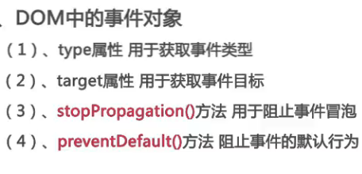
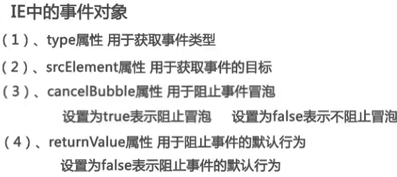

[toc]
> 事件：是文档或浏览器窗口中发生的特定的交互瞬间。

## 1. 事件流
> 指的是：从页面中接受事件的顺序。分为：**事件冒泡流**和事件捕获流。

- 事件冒泡：


- 事件捕获：


### 1.1 到底选择哪种
目前来说，Chrome两种都支持，IE早期版本只支持事件冒泡，所以考虑兼容，请使用**事件冒泡流**。

### 1.2 事件冒泡
当点击输入文本框的时候，根据事件冒泡，浏览器会弹出`hello`.

```html
<html>
	<head>
		<meta charset="utf-8">
	</head>
	<body>
	<div class="outer" onclick="alert('hello');">
		<input type="text">
	</div>
	</body>
</html>
```

## 2. 事件处理程序
### 2.1 HTML事件处理程序
> 顾名思义，事件直接加到HTML上。缺点是耦合度很高，所以一般不这么使用。

除了上面的例子，下面这种也是：
```html
<html>
    <head>
        <title>事件处理程序</title>
        <meta charset="utf-8"/>
    </head>
    <body>
        <div id="box">
            <input type="button" value="按钮" id="btn-1" onclick="showMessage()">
        </div>
        <script>
            function showMessage(){
                alert("hello,world!")
            }
        </script>
    </body>
</html>
```

### 2.2 DOM0级事件处理程序
> 定义：把一个函数赋值给一个事件的处理程序属性。用的较多，简单，**可以跨浏览器**。

```html
<html>
    <head>
        <title>事件处理程序</title>
        <meta charset="utf-8"/>
    </head>
    <body>
        <div id="box">
            <input type="button"  value="按钮2" id="btn-2">
        </div>
        <script>
            let btn2 = document.getElementById("btn-2");
            /* 下面给btn2添加onclick属性 */
            btn2.onclick = function(){
                alert("Dom0级")
            }
            /* btn2.onclick = null; */ //DOM0级删除事件处理的方法
        </script>
    </body>
</html>
```


### 2.3 DOM2级事件处理程序
> **所有的DOM节点都支持，并且对一个节点添加多个事件处理程序。**
> 同样，DOM2级添加的事件必须通过DOM2级来删除。


**第三个参数：`false`代表冒泡，`true`代表捕获。为了兼容，直接设置成`false`。**

示例如下：
```html
<html>
    <head>
        <title>事件处理程序</title>
        <meta charset="utf-8"/>
    </head>
    <body>
        <div id="box">
            <input type="button"  value="按钮3" id="btn-3">
        </div>
        <script>
            function showMessage(){
                alert("hello,world!")
            }
            let btn3 = document.getElementById("btn-3");
            btn3.addEventListener("click",function(){
                alert("第一个事件：DOM2");
            },false);
            btn3.addEventListener("click",function(){
                alert("第二个事件：DOM2。我是"+this.value);
            },false);
            btn3.addEventListener("click",showMessage,false);
            btn3.removeEventListener("click",showMessage,false);
        </script>
    </body>
</html>
```


### 2.4 IE事件处理程序及多浏览器兼容


由于IE8及更早版本，只支持事件冒泡，所以，没有第三个布尔值参数。

event.js:
```javascript
var eventUtil = {
    // 添加句柄
    addHandler:function(element,type,handler){
        // 使用能力检测来保证浏览器兼容
        if(element.addEventListener){
            element.addEventListener(type,handler,false); // 这里是 click
        }else if(element.attachEvent){
            element.attachEvent("on"+type,handler,false); //注意这里需要onclick
        }else {
            element["on"+element] = handler;
        }
    },
    // 删除句柄
    removeHandler:function(element,type,handler){
        if(element.removeEventListener){
            element.removeEventListener(type,handler,false);
        } else if(element.detachEvent){
            element.detachEvent("on"+type,handler);
        } else {
            element["on"+element] = null;
        }
    }
}
```

demo.html:
```html
<html>
    <head>
        <title>事件处理程序</title>
        <meta charset="utf-8"/>
        <script type="text/javascript" src="event.js"></script>
    </head>
    <body>
        <div id="box">
            <input type="button" value="按钮" id="btn-1" onclick="showMessage()">
            <input type="button"  value="按钮2" id="btn-2">
            <input type="button"  value="按钮3" id="btn-3">
        </div>
        <script>
            function showMessage(){
                alert("hello,world! My name is "+this.value)
            }
            let btn2 = document.getElementById("btn-2");
            let btn3 = document.getElementById("btn-3");
            eventUtil.addHandler(btn2,"click",showMessage);
            eventUtil.addHandler(btn3,"click",showMessage);
        </script>
    </body>
</html>
```

## 3. 事件对象
> 在触发DOM事件时候产生一个对象(`event`)，包含操作的所有信息。

### 3.1 DOM中的事件对象
下面这张图是DOM事件对象中比较重要的方法和属性：



demo.html
```html
<html>
    <head>
        <title>事件处理程序</title>
        <meta charset="utf-8"/>
        <script type="text/javascript" src="event.js"></script>
    </head>
    <body>
        <div id="box">
            <input type="button" value="按钮" id="btn-1" onclick="showMessage(event)">
            <input type="button"  value="按钮2" id="btn-2">
            <input type="button"  value="按钮3" id="btn-3">
            <br/>
        </div>
        <a href="https://www.baidu.com/" target="_blank" id="go">点我不会跳转</a>
        <script>
            /* 使用时间对象Event */
            function showMessage(event){
                alert(event.type+"/n"+event.target.nodeName);
                event.stopPropagation();
            }
            function showBox(event){
                alert("点击按钮3，不会出现我。说明阻止了冒泡。")
            }
            function stopGoTo(event){
                event.stopPropagation();
                event.preventDefault();
            }
            let btn2 = document.getElementById("btn-2");
            let btn3 = document.getElementById("btn-3");
            eventUtil.addHandler(btn2,"click",showMessage); // 这里不需要showMessage(event)
            eventUtil.addHandler(btn3,"click",showMessage);
            
            /* 阻止冒泡 */
            let box = document.getElementById("box");
            eventUtil.addHandler(box,"click",showBox);

            /* 取消默认行为 */
            let go = document.getElementById("go");
            eventUtil.addHandler(go,"click",stopGoTo);
        </script>
    </body>
</html>
```

### 3.2 IE中的事件对象
IE8之前的浏览器，event是`window.event`。可以通过`event = event || window.event;`来兼容IE浏览器。

下面这张图是IE事件对象中比较重要的方法和属性：



## 4. 对于事件对象和事件处理程序的跨浏览器兼容(不使用JQuery)
我们将其封装为3个文件：
- 兼容代码：event.js
- 网页脚本：script.js
- 网页代码：demo.html

#### event.js
```javascript
var eventUtil = {
    // 添加句柄
    addHandler:function(element,type,handler){
        // 使用能力检测来保证浏览器兼容
        if(element.addEventListener){
            element.addEventListener(type,handler,false); // 这里是 click
        }else if(element.attachEvent){
            element.attachEvent("on"+type,handler,false); //注意这里需要onclick
        }else {
            element["on"+element] = handler;
        }
    },
    // 删除句柄
    removeHandler:function(element,type,handler){
        if(element.removeEventListener){
            element.removeEventListener(type,handler,false);
        } else if(element.detachEvent){
            element.detachEvent("on"+type,handler);
        } else {
            element["on"+element] = null;
        }
    },
    // 获取事件
    getEvent:function(event){
        event = event || window.event;
        return event;
    },
    // 阻止默认行为
    preventDefault:function(event){
        if(event.preventDefault){
            event.preventDefault();
        } else {
            event.returnValue = false;
        }
    },
    // 阻止事件冒泡
    stopPropagation:function(event){
        if(event.stopPropagation){
            event.stopPropagation();
        } else {
            event.cancelBubble = true;
        }
    },
    getType:function(event){
        return event.type;
    },
    getElement:function(event){
        return event.target || event.srcElement;
    }
}
```

#### script.js
```javascript
window.onload = function(){
    let go = document.getElementById("go");
    let box = document.getElementById("box");
    eventUtil.addHandler(box,"click",function(){
        alert("我是整个父盒子");
    });

    eventUtil.addHandler(go,"click",function(event){
        event = eventUtil.getEvent(event);
        alert(eventUtil.getElement(event));
        eventUtil.preventDefault(event); // 进制默认行为
    });

    let button_arr = document.getElementsByTagName("input");
    for(let i=0;i<button_arr.length;++i){
        eventUtil.addHandler(button_arr[i],"click",function(e){
            e = eventUtil.getEvent(e);
            eventUtil.stopPropagation(e); // 阻止冒泡
            alert("hello,I am "+this.value);
        })
    }

}
```

#### demo.html
```html
<html>
    <head>
        <title>事件处理程序</title>
        <meta charset="utf-8"/>
        <script type="text/javascript" src="event.js"></script>
        <script type="text/javascript" src="script.js"></script>
    </head>
    <body>
        <div id="box">
            <input type="button" value="按钮" id="btn-1" onclick="showMessage(event)">
            <input type="button"  value="按钮2" id="btn-2">
            <input type="button"  value="按钮3" id="btn-3">
            <br/>
        </div>
        <a href="https://www.baidu.com/" target="_blank" id="go">点我不会跳转</a>
    </body>
</html>
```