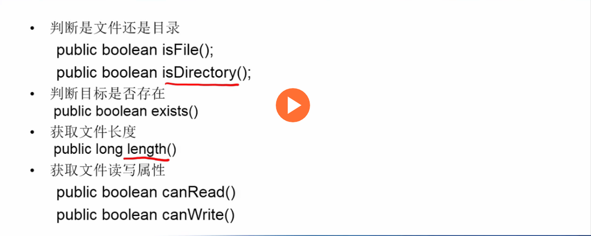
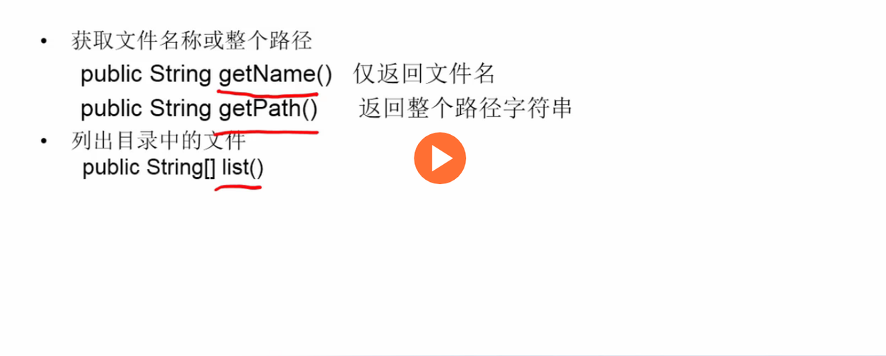
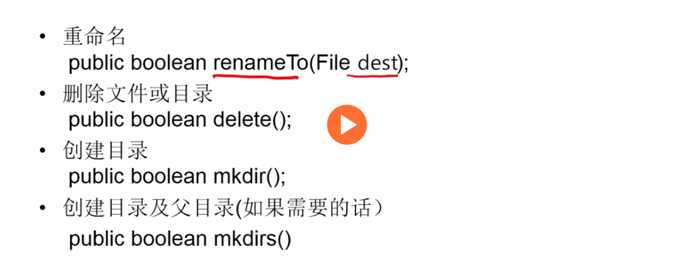
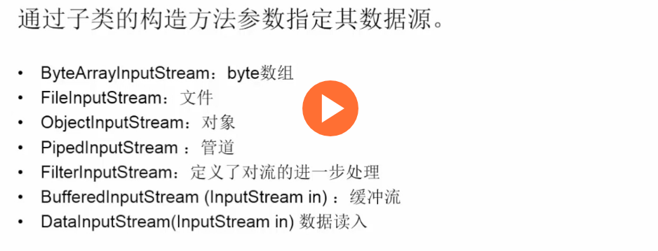
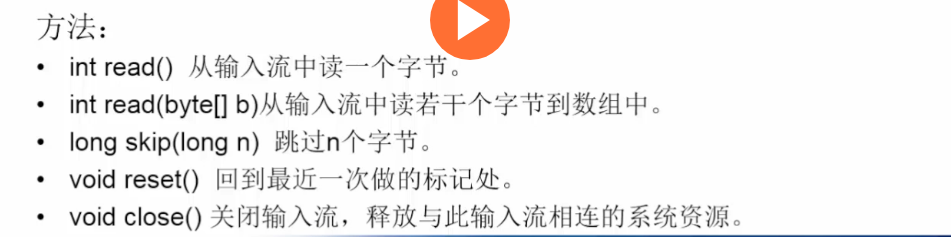
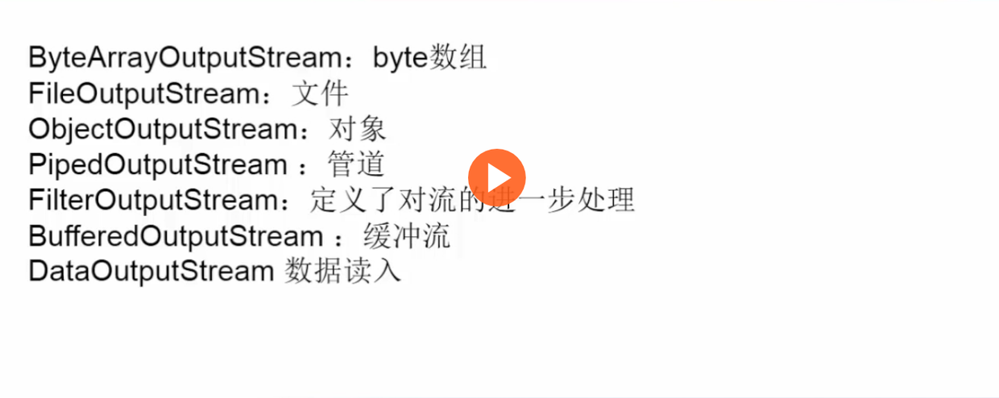
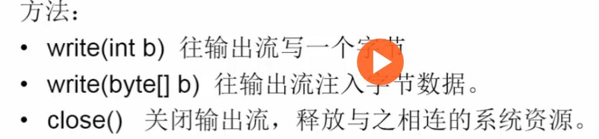
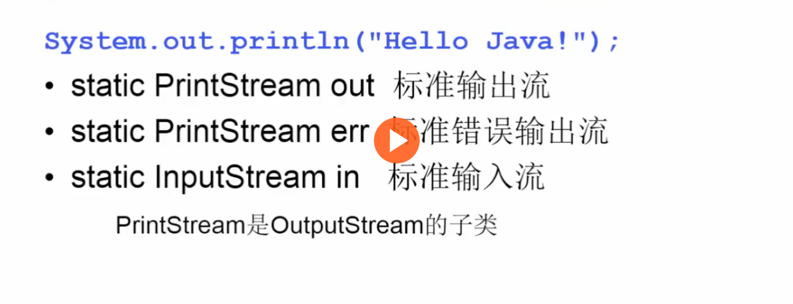
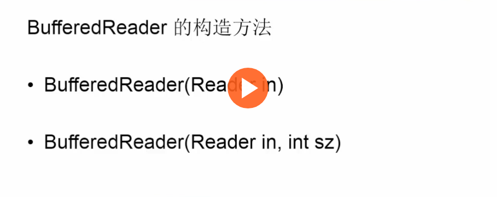
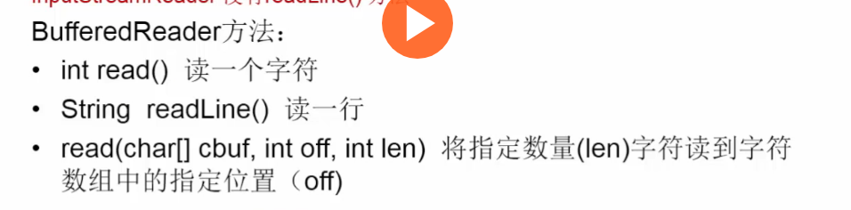

[toc]

## 0. File类
***
> 描述目录或者文件的名字、长度、读写等属性，可用来**重命名文件、查询文件属性、移动文件**等。但是，**不能读写文件内容。**

### 0.0 构造方法

- `File(String path)`
    - 文件（建议使用相对路径）：`File f1 = new File("scr/Hello.java");`
    - 目录（绝对路径）：`File f2 = new File("d://java//scr");`
- `File(String parent,String child)`:例如：`File f3 = new File("d://src","test.java");`
- `File(File dir,String name)`:例如：`File f4 = new File(f2,"test.java");`

### 0.1 关于多系统的兼容：
因为每个系统的文件路径的分割符不同，所以java提供了：`File.separator`作为分隔符。在windows下就是`/`，在linux下就是`/`。

### 0.2 属性方法
> 一些用于读取目录或者文件及其相关属性的方法。






### 0.3 操作方法
> 一些移动、复制等相关方法。




## 1. 输入输出流
***
> 虽然`File`类不可以读写文件内容，所以有了输入输出流来解决这个问题。而它可以分为字节输入输出和字符输入输出。

### 1.0 字节输入流
#### 1.0.0 介绍
1. 单位是字节
2. InputStream是所有表示输入字节流类的父类（**抽系类**）。
因此，他需要用子类来实现输入：




#### 1.0.1 方法



### 1.1 字节输出流
#### 1.1.0 介绍
1. 单位是字节
2. OutputStream是所有表示输出字节流类的父类（**抽系类**）。
因此，他需要用子类来实现输入：





#### 1.1.1 方法





#### 1.1.3 可以读可以不读：System类



### 1.2 字节流实例
```java

import java.io.*;
public class BytesInputOutput {
    public static void main(String []args) {
        // Input Demo
        try {
            FileInputStream in = new FileInputStream("input.txt"); // 字节流
            int size = in.available();
            byte[] bytes = new byte[size];
            in.read(bytes);
            System.out.println(new String(bytes));
        } catch ( IOException e) {
            System.err.println(e);
        } catch (Exception e) {
            System.err.println(e);
        }

        // Output Demo
        try {
            byte[] bytes = "您好,World!".getBytes();
            FileOutputStream out = new FileOutputStream("output.txt");
            out.write(bytes);
            out.close();
        } catch (IOException e){
            System.err.println(e);
        } catch (Exception e) {
            System.err.println(e);
        }
    }
}
```

## 2. 缓冲流
> 缓冲流初始化参数只能是**字符流**。很多时候我们想逐行读取，这时候用到缓冲流。


### 2.0 构造方法



### 2.1 方法




### 2.2 缓冲流实例
```java
import java.io.*;
public class BufferInputOutput {
    public static void main(String[]args) {
        try{
            // InputStreamReader将字节流转化成字符流，并且指明二进制的编码方式。推荐使用"utf-8"
            // 具体思想参考python文件读取
            BufferedReader in = new BufferedReader(new InputStreamReader(new FileInputStream("input.txt"),"utf-8"));
            BufferedWriter out = new BufferedWriter(new OutputStreamWriter(new FileOutputStream("output.txt"),"utf-8"));
            String line;
            while((line=in.readLine())!=null){
                System.out.println(line);
                out.write(line+"/n");
            }
            in.close();
            out.close();
        } catch (IOException e) {
            System.err.println(e);
        } catch (Exception e) {
            System.err.println(e);
        }
    }
}
```
