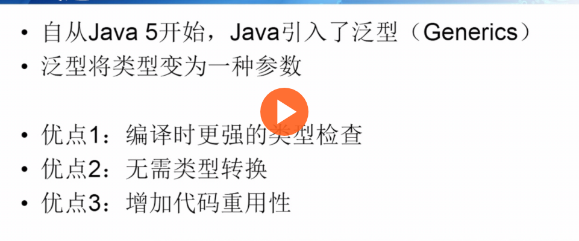
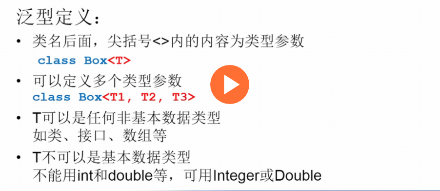
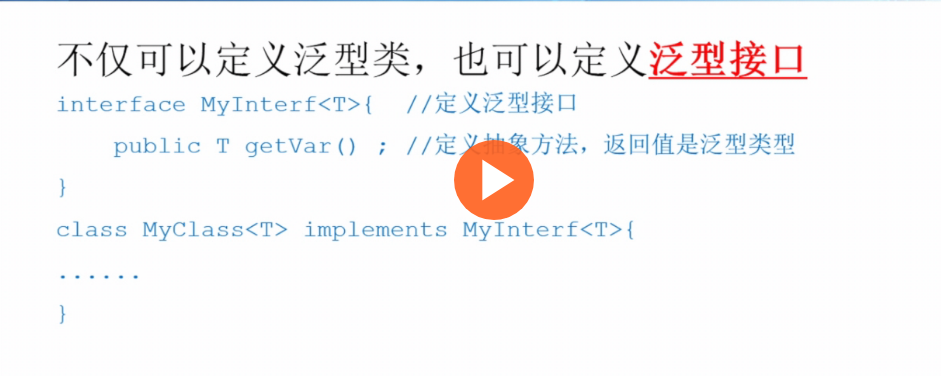

[toc]
> 写一篇笔记简单记录一下`java`泛型的用法，注意：**泛型不能使用基础类。**

## 0. 泛型的优点和一个简单的Demo





下面是一个简单的Demo:
```java
package test;
class Box<T> {
    private T t;
    public void set(T t){
        this.t = t;
    }
    public T get() {
        return t;
    }
}
public class Test {
    public static void main(String[]args) {
        String str = "Hello World";
        Box<String> box = new Box<String>();
        box.set(str);
        System.out.println("In box it's "+box.get());
    }
}
```

## 1. 泛型定义和使用
### 1.0 泛型类
> 上面的demo就是泛型类的例子，除此之外：



### 1.1 泛型接口
> 除了泛型类，接口也可以实现泛型：



一个demo:
```java
package test;
interface Box<T> {
    public T getValue();
}

public class Test<T> implements Box<T>{
    T t;
    public Test(T t){
        this.t =t;
    }
    public T getValue(){
        return t;
    }
    public static void main(String[]args) {
        String str = "Hello World";
        Test tester = new Test(str);
        System.out.println(tester.getValue());
    }
}
```
