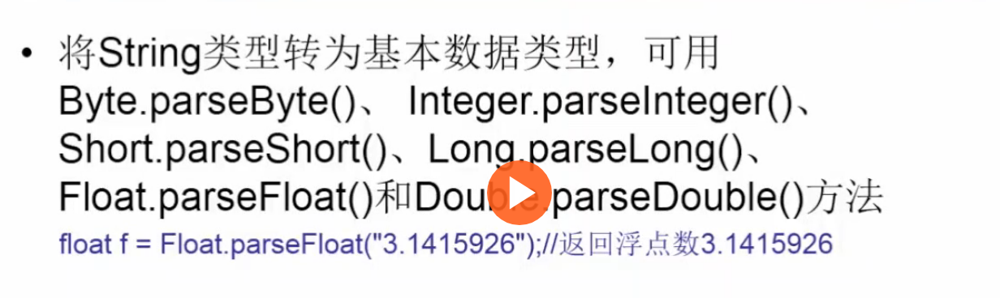
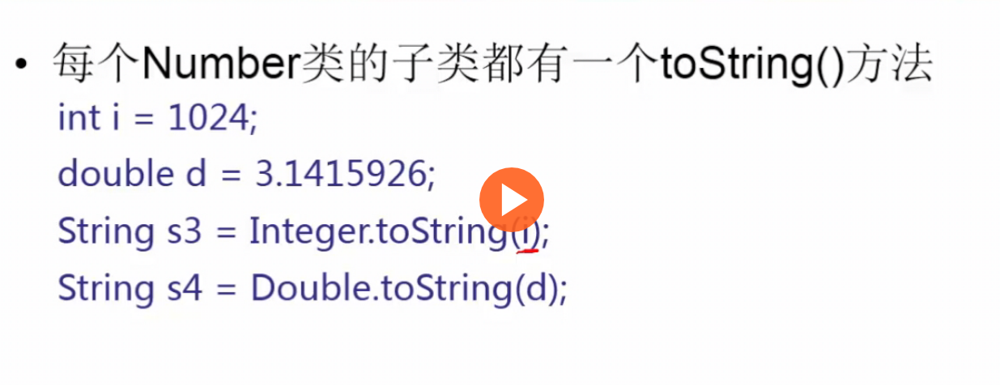

[toc]
## 0. `String`类
> 采用`utf-16`编码，所以一般不用担心在中文下出现乱码

### 基本操作
| 作用 | 命令 |
| - | - |
| 连接字符串 | `str.concat(str2)` |
| 替换字符　| `str.replace(oldChar,newChar)` |
| 切片操作 | `str.substring(start[,end])` |

### 比较
> 注意直接使用`==/!=`进行比较的时候可能无法得到正常结果，因为编译器比较的是地址。如果对字符串只是比较值，那么：`str.equals(str2)`或者　`str.equalsIgnoreCase(str2)`

### 查询操作
| 作用 | 命令 |
| - | - |
| 是否存在 | `str.contains(str2)` |
| 查找位置 | `str.indexOf(str2)` |
| 检测开头或结尾 | `str.startsWith()`和`str.endsWith()`|

### **和`Number`之间的转换**

## 1. `StringBuilder`类
> 如果经常对字符串进行修改操作，请看Java5中新增的类：
>   - 优点：字符串修改操作高效
>   - 缺点：多线程不安全

### 一些属性和构造方法
1. `length()和capcity()`：分别指的是长度和容量。容量>=长度的。
1. `new StringBuilder()`
2. `new StringBuilder(int Capicity)`：指定容量
3. `new StringBuilder(String s)`：会在结尾再加16个存储单元

### 常见操作
| 作用 | 命令 |
| - | - |
| 删除 | `str.delete(start,end)`|
| 插入 | `str.insert(index,str2)` |
| 替换 | `str.replace(start,end,s)`|
| 尾部添加 | `str.append(s)` |
| 反转 | `str.reverse()` |

## 2. `StringBuffer`类
> 操作基本与`StringBuilder`类相同，但是，它是**线程安全**的。作为代价，会牺牲一些速度。
