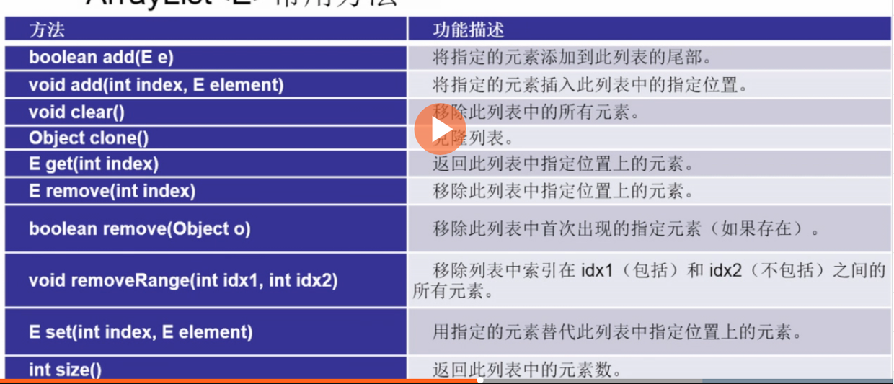

[toc]
> 关于集合类和Map类的一篇学习笔记和用于回查的api。

## 0.、集合类(`Collection`)

***

### 0.0 `ArrayList<E>`
> 虽然很方便，但是它不是线程安全的。所以，如果多线程任务，可以使用`Vector<E>`类。

- 基础方法：

| 功能 | 代码　|
|- | - |
| 添加　| `arr.add(ele)/arr.add(index,ele)` |
| 大小 |  `arr.size()` |
| 获取指定元素 | `arr.get(index)`|

- 更多方法：


### 0.1 `LinkedList<E>`：双向链表
- 用途：


- 常见方法(基本与`ArrayList<E>`一致)：


### 0.2 `HashSet<E>`
> 类似与数学中的set，同样具有三大特性。因为无序性，所以set里面的元素的顺序会变，无法保证。

- 方法：


- 集合操作：


### 0.3 `TreeSet<E>`
> - 这个泛型类是有序集合，使用元素的自然顺序对元素排序。**当然，可以根据`Comparator`自定义排序**
> - 同`HashSet`类一样，没有`get()`方法，**要使用迭代器获得列表中元素**。

下面是一个排序并且遍历其中元素的demo：
```java
package test;
import java.util.*;

class Person implements Comparable {
    String name;
    int age;
    public Person(String n,int a){
        name = n;
        age = a;
    }
    // 参数必须是：Object 类型
    // 需要强制转化
    public int compareTo(Object p){
        Person person = (Person)p;
        return (this.age - person.age); // 从小到大排序
    }
    public String toString(){
        return "姓名:"+name+";年龄:"+age;
    }
}

public class Test{

    public static void main(String[]args) {
        TreeSet<Person> ts = new TreeSet<Person>();
        ts.add(new Person("Army",25));
        ts.add(new Person("Frank",20));
        ts.add(new Person("To",30));
        // 采用for-each遍历
        for (Person person:ts) {
            System.out.println(person);
        }
    }
}

```

## 1、`Map<key,value>`类

***

> 和之前说的`Collection`不同，`Map`中的元素是一对一对出现的。提供３中ｃｏｌｌｅｃｔｉｏｎ视图，如下：


### 常用方法
| 功能 | 代码　|
|- | - |
| 添加 | `m.put(key,value)` |
| 获取 | `m.get(key)` |
| 检查是否包括 | `m.contains(key)或者m.containsValue(value)` |
| 返回key集合 | `m.keySet()`|
| 返回value集合 | `m.values()` |
| 返回key-value集合 | `m.entrySet()`|
