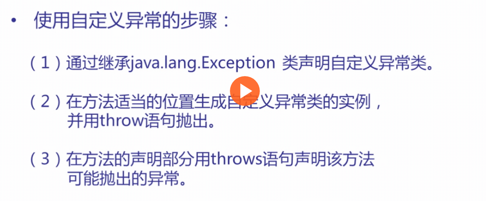

## 异常处理的语法和示例
***

### 注意事项
1. 多个异常，先写子类异常，再写父类异常
2. `throws`一般用于我们处理不了的异常，将其一直向上抛出，最后抛给系统。或者用于对于自定义异常类的声明

#### `throws`
格式：`修饰符　返回类型　方法名([参数表])　throws 异常1,异常2,...{...}`

#### `throw`抛出异常
如果需要在某个位置抛出异常，可以结合`if`使用。

格式：
1. `throw 异常类对象名;`
2. `throw (new 异常类名());`

#### `try-catch-finally`捕获异常
其中，`try`和`catch`是必须有的。而`catch`语句可以写多条（先写子类异常）。`finally`是无论是否异常都要执行的语句，根据情况选择

### 示例/demo
```java
import java.io.*;
import java.util.*;

public class test {
    public static void main(String[]args) {
        try {
            System.out.println("Before opening a file");
            FileReader reader=new FileReader("/home/test");
        } catch (FileNotFoundException error) {
            System.out.println("Can't find the file");
        } catch (Exception  error) {
            System.out.println("Other error open");
        }
        System.out.println("After opening");
    }
}
```

控制台的输出情况是：
```
Before opening a file
Can't find the file
After opening
```

## 自定义异常类
***
> 很多时候，我们需要一个更符合自己情况的异常，这时候就需要我们自己定义一个异常类。

### 步骤如下



### 示例/demo
```java
import java.io.*;
import java.util.*;

class NewException extends Exception{ // 继承一个Exception类
    private int num;
    NewException(int num) {
        this.num = num;
    }
    public String toString(){ // 用于输出错误信息
        return "Find NewException, num is "+this.num+".";
    }
}
public class test {
    static void compute(int num) throws NewException { // 声明自定义的Exception 不需要extends
        System.out.println("Call function(compute)");
        if(num>10)
            throw new NewException(num);
        System.out.println("Run normally");
    }
    public static void main(String[]args) {

        try {
            compute(1);
            compute(11);
        } catch (NewException error) {
            System.out.println(error);
        }
    }
}

```

控制台输出结果是：
```
Call function(compute)
Run normally
Call function(compute)
Find NewException, num is 11.
```
