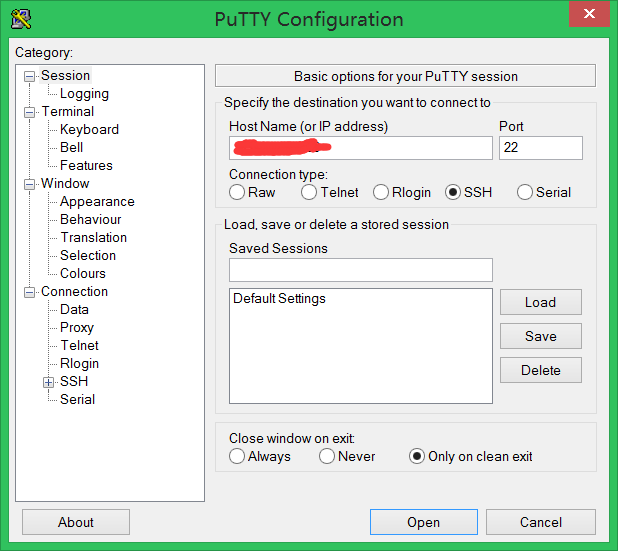
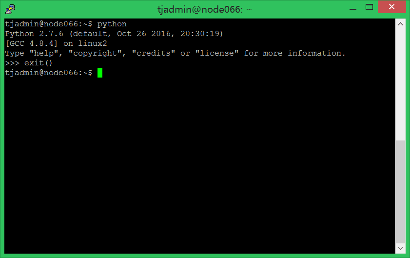

>　平常我们使用**windows**或者**Ubuntu**系统，由于一些需求，需要**连接服务器来跑程序**（服务器基本都是Ubuntu）和**文件传输**。下面分两个我们最长用的平台来记录。

## 0. Windows平台

### 0.0　两款工具(直接百度，下载即可)
- 文件传输：[WinSCP](http://baike.baidu.com/link?url=tZp1xxb3pW3-dFdDHMjzAyek7FhFzlgMnu1TPnbrlTemp9yKCbxL4FBOv-NjdNzKwPg3NiHLss_-MKsNrlwwTK)
- 连接服务器（运行程序）：[putty](http://baike.baidu.com/link?url=0Rx66v_CktZlG5WaRpaAneO_TSXj6AFMEBaSeJz8I17M-pc2Dg3wA7Fqkn-CoLxOsoT5Gtxef6Bv0gVMdZmGra)的用法。

### 0.1 putty
> 远程cmd窗口，在本机通过命令行操作服务器，并且拿到运行结果。而本机只有连接作用，大大减小了负担。

登陆界面输入ip地址，没有特殊情况，默认选项就可以了。



输入用户名和密码，进行登陆。


然后就可以在服务器上跑程序了。



### 0.2 WinSCP
> 极为方便地管理远程服务器的文件夹。然后再用上面的putty就可以运行程序了。

登陆界面输入ip，账号，密码


进入后，左边是本机的文件夹，右边是服务器的文件夹。可以方便的进行文件转移。然后再打开putty运行程序。


## 1. Ubuntu平台
> 由于命令行界面，所以非常简洁，这里就不截图了。直接按照下面操作即可。

### 1.0 两款工具
- 连接服务器:`ssh`
- 文件传输:`scp`

### 1.1 安装
```shell
sudo apt install scp
sudo apt install ssh
```
### 1.2 `ssh`
- 连接：`ssh 用户名@ip地址`。回车后，再输入密码即可。
- 退出连接:`exit`（和关闭命令行的命令相同）

### 1.3 `scp`
- 将本地文件拷贝到远程：`scp  文件名 用户名@计算机IP或者计算机名称:远程路径 `
- 从远程将文件拷回本地：`scp  用户名@计算机IP或者计算机名称:文件名本地路径`
- 将本地目录拷贝到远程：`scp -r 目录名   用户名@计算机IP或者计算机名称:远程路径`
- 从远程将目录拷回本地：`scp -r   用户名@计算机IP或者计算机名称:远程路径 目录名`

## 2. More(直接点击即可)
1. [WinSCP](http://baike.baidu.com/link?url=tZp1xxb3pW3-dFdDHMjzAyek7FhFzlgMnu1TPnbrlTemp9yKCbxL4FBOv-NjdNzKwPg3NiHLss_-MKsNrlwwTK)
2. [putty](http://baike.baidu.com/link?url=0Rx66v_CktZlG5WaRpaAneO_TSXj6AFMEBaSeJz8I17M-pc2Dg3wA7Fqkn-CoLxOsoT5Gtxef6Bv0gVMdZmGra)
3. [scp](http://blog.csdn.net/bykjscn/article/details/8619274)

***

> 欢迎进一步交流本博文相关内容：<br>
GitHub地址 ：<https://github.com/AsuraDong/Blog><br>
CSDN地址 : <http://blog.csdn.net/asuradong><br>
简书地址：<http://www.jianshu.com/u/d1570f4a618a><br>
博客园地址 : <http://www.cnblogs.com/AsuraDong/>(不一定及时更新)<br>
也可以致信进行交流 : <xiaochiyijiu@163.com> <br>
欢迎关注个人微博：<http://weibo.com/AsuraDong><br>
**欢迎转载** , 但*请指明出处  :  )*

***
