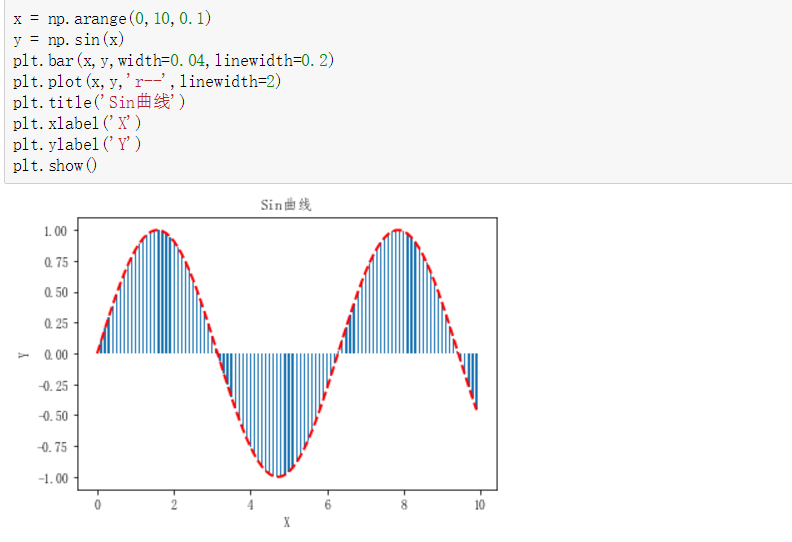
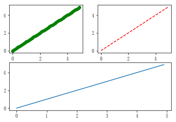

[toc]

> 一篇matplotlib库的学习博文。matplotlib对于数据可视化非常重要，它完全封装了MatLab的所有API，在python的环境下和Python的语法一起使用更是相得益彰。

### 一、库的安装和环境的配置

windows下：`py -3 -m pip install matplotlib`

linux下：`python3 -m pip install matplotlib`

建议配合Jupyter使用。在jupyter notebook中，使用`%matplotlib inline`，即可进入交互页面（类似下图）




### 二、设置中文环境

首先引入包：
```python
import numpy as np #之后需要用到
import matplotlib as mpl #设置环境变量
import matplotlib.pyplot as plt #绘图专用
from mpl_toolkits.mplot3d import Axes3D #绘制3D图
```

为了让图片兼容中文的说明、名字等，这里需要：
```python
mpl.rcParams['font.sans-serif'] = ['FangSong']
mpl.rcParams['axes.unicode_minus']=False
```

### 三、一窥全貌

首先，我们画一张正弦和余弦图。
```python
plt.figure('sin/cos', dpi=70)
# 创建一个新的 1 * 1 的子图，接下来的图样绘制在其中的第 1 块（也是唯一的一块）
plt.subplot(1,1,1)
X = np.linspace(-np.pi, np.pi, 256,endpoint=True)
C,S = np.cos(X), np.sin(X)
# 绘制余弦曲线，使用蓝色的、连续的、宽度为 1 （像素）的线条
plt.plot(X, C, color="blue", linewidth=1.0, linestyle="-")
# 绘制正弦曲线，使用绿色的、连续的、宽度为 1 （像素）的线条
plt.plot(X, S, color="green", linewidth=1.0, linestyle="-")
# 设置横轴的上下限
plt.xlim(-4.0,4.0)
# 设置横轴记号
plt.xticks(np.linspace(-4,4,9,endpoint=True))
# 设置纵轴的上下限
plt.ylim(-1.0,1.0)
# 设置纵轴记号
plt.yticks(np.linspace(-1,1,5,endpoint=True))
# 以分辨率 72 来保存图片
# savefig("exercice_2.png",dpi=72)
# 在屏幕上显示
plt.show()
```


1. `plt.figure(name,dpi)`:name是图片的名字，dpi是分辨率
1. `plt.plot(x,y,color,linewidth,linestyle,label)`：用来绘制点线图。color是线条颜色，linewidth是宽度，linestyle可以设置成`--`，就变成了虚线。<br>
label参数和图例有关
2. `plt.xlim(min,max)/plt.ylim(min,max)`：设置x/y轴的范围。
3. `plt.xtricks(列表)/plt.ytricks(列表)`：设置x轴/y轴的上显示的值。<br>
如果想要设置记号标签（我们可以把 3.1423.142 当做是 ππ，但毕竟不够精确。当我们设置记号的时候，我们可以同时设置记号的标签。注意这里使用了 LaTeX）。可以传入两个对应的列表。
4. `plt.legend(loc=随机默认)`：添加图例，图例来自于plt.plot()参数里的label，如果想让label按照公式显示，需要在字符串前后加$。即：`label='$sin(x)$'`<br>
loc参数定义图标位置，可以是`upper left/right`类似的方向。
5. `plt.xlabel(labelname)/ylabel(labelname)`：添加x/y轴的名字并且显示出来。
6. `plt.scatter(xlist,ylist)`:根据需要标注图中的特殊点。
7. `plt.title()`：给图一个名字
7. 移动坐标轴：（之前的图片还是不好看）实际上每幅图有四条脊柱（上下左右），为了将脊柱放在图的中间，我们必须将其中的两条（上和右）设置为无色，然后调整剩下的两条到合适的位置——数据空间的 0 点。 
```python
ax = plt.gca()
ax.spines['right'].set_color('none')
ax.spines['top'].set_color('red')
ax.xaxis.set_ticks_position('bottom')
ax.spines['bottom'].set_position(('data',0))
ax.yaxis.set_ticks_position('left')
ax.spines['left'].set_position(('data',0))
```


改进后的代码如下：
```python
plt.figure(figsize=(8,6), dpi=70)

# 创建一个新的 1 * 1 的子图，接下来的图样绘制在其中的第 1 块（也是唯一的一块）
plt.subplot(1,1,1)

X = np.linspace(-np.pi, np.pi, 256,endpoint=True)
C,S = np.cos(X), np.sin(X)

plt.plot(X, C, color="blue", linewidth=1.5, linestyle="--",label="$y=cos(x)$")
plt.plot(X, S, color="red", linewidth=1.0, linestyle="-",label='$y=sin(x)$')

plt.xlabel('Y')
plt.ylabel('X')

plt.xlim(X.min()*1.1,X.max()*1.1)
plt.xticks([-np.pi, -np.pi/2, 0, np.pi/2, np.pi],/
       [r'$-/pi$', r'$-/pi/2$', r'$0$', r'$+/pi/2$', r'$+/pi$'])
plt.ylim(C.min()*1.1,C.max()*1.1)
plt.yticks([-1, 0, +1],/
       [r'$-1$', r'$0$', r'$+1$'])

ax = plt.gca()
ax.spines['right'].set_color('none')
ax.spines['top'].set_color('none')
ax.xaxis.set_ticks_position('bottom')
ax.spines['bottom'].set_position(('data',0))
ax.yaxis.set_ticks_position('left')
ax.spines['left'].set_position(('data',0))
# 以分辨率 72 来保存图片
# savefig("exercice_2.png",dpi=72)

t = 2*np.pi/3
plt.scatter([t,],[np.cos(t),], 20, color ='black')
plt.scatter([t,],[np.sin(t),], 20, color ='black')

plt.legend(loc="upper left")
plt.title('三角函数示意图')
# 在屏幕上显示
plt.show()
```

**现在来看一下处理过后的图的样子：**


### 四、精益求精
```python
plt.figure('sin/cos', dpi=70)

# 创建一个新的 1 * 1 的子图，接下来的图样绘制在其中的第 1 块（也是唯一的一块）
#plt.subplot(112)

X = np.linspace(-np.pi, np.pi, 256,endpoint=True)
C,S = np.cos(X), np.sin(X)

plt.plot(X, C, color="blue", linewidth=1.5, linestyle="--",label="$y=cos(x)$")
plt.plot(X, S, color="red", linewidth=1.0, linestyle="-",label='$y=sin(x)$')

plt.xlabel('Y')
plt.ylabel('X')

plt.xlim(X.min()*1.1,X.max()*1.1)
plt.xticks([-np.pi, -np.pi/2, 0, np.pi/2, np.pi],/
       [r'$-/pi$', r'$-/pi/2$', r'$0$', r'$+/pi/2$', r'$+/pi$'])
plt.ylim(C.min()*1.1,C.max()*1.1)
plt.yticks([-1, 0, +1],/
       [r'$-1$', r'$0$', r'$+1$'])

ax = plt.gca()
ax.spines['right'].set_color('none')
ax.spines['top'].set_color('none')
ax.xaxis.set_ticks_position('bottom')
ax.spines['bottom'].set_position(('data',0))
ax.yaxis.set_ticks_position('left')
ax.spines['left'].set_position(('data',0))
# 以分辨率 72 来保存图片
# savefig("exercice_2.png",dpi=72)

t = 2*np.pi/3
plt.scatter([t,],[np.cos(t),], 20, color ='black')
plt.scatter([t,],[np.sin(t),], 20, color ='black')

plt.annotate(r'$/sin(/frac{2/pi}{3})=/frac{/sqrt{3}}{2}$',/
         xy=(t, np.sin(t)), xycoords='data',/
         xytext=(+10, +30), textcoords='offset points', fontsize=16,/
         arrowprops=dict(arrowstyle="->", connectionstyle="arc3,rad=.2"))

plt.annotate(r'$/cos(/frac{2/pi}{3})=-/frac{1}{2}$',/
         xy=(t, np.cos(t)), xycoords='data',/
         xytext=(-90, -50), textcoords='offset points', fontsize=16,/
         arrowprops=dict(arrowstyle="->", connectionstyle="arc3,rad=.2"))

plt.plot([t,t],[0,np.cos(t)], color ='blue', linewidth=2.5, linestyle="--")
plt.plot([t,t],[0,np.sin(t)], color ='red', linewidth=2.5, linestyle="--")

plt.legend(loc="upper left")
plt.title('三角函数示意图')
# 在屏幕上显示
plt.show()
```


我们添加了标注点，并且向x轴做了垂线，使其更清晰。

### 五、图的存储
这么漂亮的图，还是通过`plt.savefig(照片名字+后缀名)`保存到本地吧。

### 六、子图
`plt.subplot(x,y,n)`:将图片分成x*y块，这个图是第n个。（看示例）

示例一：
```python
x = np.arange(0, 5, 0.1)  
y = np.arange(0, 5, 0.1)  
  
#plt.figure(1)  
plt.subplot(221)  
plt.plot(x, y, 'go')
  
plt.subplot(222)  
plt.plot(x, y, 'r--')  

plt.subplot(212)  
plt.plot(x, y,)  
  
plt.show()  
```





示例二：
```python
x = np.arange(0, 5, 0.1)  
y = np.arange(0, 5, 0.1)  
  
#plt.figure(1)  
plt.subplot(221)  
plt.plot(x, y, 'go')
  
plt.subplot(222)  
plt.plot(x, y, 'r--')  

plt.subplot(224)  
plt.plot(x, y,)  
  
plt.show()  
```


### 致谢
[译文作者](https://liam0205.me/2014/09/11/matplotlib-tutorial-zh-cn/)

[原文大神](http://www.labri.fr/perso/nrougier/teaching/matplotlib/)
