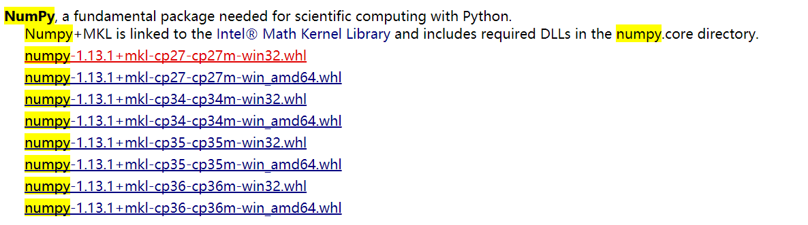
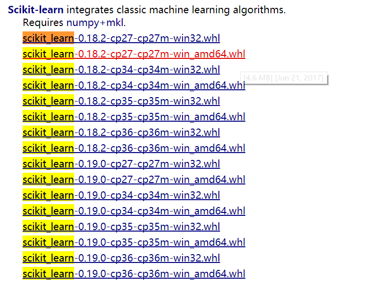

> `scikit-learn`是一款非常不错的机器学习框架，里面高度封装了常见的机器学习算法。在我做项目的时候，目前用的基本是他（之后会考虑`tensorflow`）。但是在windows的安装下需要踩一些坑。

1. 请移步这里,[click me](http://www.lfd.uci.edu/~gohlke/pythonlibs/)

2. 搜索numpy。选择适合自己的系统和python版本的包下载。

3. 搜索scikit_learn，同上。

4. **同样需要安装scipy**

5. 用命令行进入下载目录，记得给**管理员权限**。然后执行 `py -3/-2 -m pip install 包的名字`即可。**请先安装numpy**
