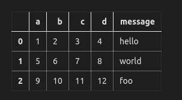
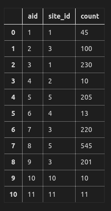

<!-- TOC -->

- [1.读取文本格式数据](#1读取文本格式数据)
- [2.逐块读取文本文件](#2逐块读取文本文件)
- [3.将数据写出到文本格式](#3将数据写出到文本格式)
- [4.DataFrame](#4dataframe)

<!-- /TOC -->
## 1.读取文本格式数据


```python
import pandas as pd
import numpy as np
import sys
import pymysql
```


```python
# 图片：pandas解析函数
```


```python
df = pd.read_csv('ex1.csv')
print(df)
```

       a   b   c   d message
    0  1   2   3   4   hello
    1  5   6   7   8   world
    2  9  10  11  12     foo
    


```python
df = pd.read_table('ex1.csv',sep=',') #可以使用read_table，但必须指定分隔符
# sep还可以是正则表达式
print(df)
```

       a   b   c   d message
    0  1   2   3   4   hello
    1  5   6   7   8   world
    2  9  10  11  12     foo
    


```python
df = pd.read_csv('ex2.csv',header = None)#不是每一个csv都有header
print(df)
```

       0   1   2   3      4
    0  1   2   3   4  hello
    1  5   6   7   8  world
    2  9  10  11  12    foo
    


```python
df = pd.read_csv('ex2.csv',names=['a','b','c','d','names'])#指定名字
print(df)
```

       a   b   c   d  names
    0  1   2   3   4  hello
    1  5   6   7   8  world
    2  9  10  11  12    foo
    


```python
names=['a','b','c','d','names']
df = pd.read_csv('ex2.csv',names=names,index_col='names') #将names做成索引
print(df)
#names对应三个，abcd分别有对应的
```

           a   b   c   d
    names               
    hello  1   2   3   4
    world  5   6   7   8
    foo    9  10  11  12
    


```python
df = pd.read_csv('csv_mindex.csv')
print('原始样子：','/n',df)
df = pd.read_csv('csv_mindex.csv',index_col=['keys','key2'])
#层次化索引.
#请注意keys和key2的顺序
print(df)
```

    原始样子： 
       keys key2  value1  value2
    0  one    a       1       2
    1  one    b       3       4
    2  two    a       9      10
    3  two    c      13      14
               value1  value2
    keys key2                
    one  a          1       2
         b          3       4
    two  a          9      10
         c         13      14
    


```python
df = pd.read_csv('ex4.csv')
print('原始样子：','/n',df)
#跳过文件的第几行
print()
df = pd.read_csv('ex4.csv',skiprows=[0,2])
print(df)
```

    原始样子： 
                                                               # hey!
    a                                           b   c   d    message
    # just wanted to make things more difficult NaN NaN NaN      NaN
    1                                           2   NaN 4      hello
    
       a  b   c  d message
    0  1  2 NaN  4   hello
    


```python
pd.isnull(df)# 处理缺失值
df = pd.read_csv('ex4.csv',skiprows=[0,2],na_values=['hello'])# 接收一组用于表示缺失值的字符串
print(df)
print(pd.isnull(df))
```

       a  b   c  d  message
    0  1  2 NaN  4      NaN
           a      b     c      d  message
    0  False  False  True  False     True
    


```python
sentinels = {'message':['foo','NA'],'d':['a','NaN']}# 用一个字典为各列指定不同的NA标记值
df = pd.read_csv('ex4.csv',skiprows=[0,2],na_values=sentinels)
print(df)
```

       a  b   c  d message
    0  1  2 NaN  4   hello
    


```python
# 图片：read_table/csv参数
```

## 2.逐块读取文本文件 


```python
# nrows参数指定只读取定行。算上第一行哦
pd.read_csv('ex1.csv',nrows=4)
```





```python
# chunksize 指定分块读取
chunks = pd.read_csv('ex1.csv',chunksize=2)
print(chunks)
```

    <pandas.io.parsers.TextFileReader object at 0x0000007D7E4A39B0>
    


```python
for chunk in chunks:
    print(chunk)
    print('='*10,)
```

       a  b  c  d message
    0  1  2  3  4   hello
    1  5  6  7  8   world
    ==========
       a   b   c   d message
    2  9  10  11  12     foo
    ==========
    

## 3.将数据写出到文本格式


```python
data = pd.read_csv('ex1.csv',nrows=3)
data.to_csv('ex1_1.csv') #to_csv写入
data.to_csv('ex1_2.csv',sep='|')# 别的分隔符
data.to_csv('ex1_1.csv',na_rep='NULL')# 缺失值会被替换为na_rep
```


```python
data.to_csv(sys.stdout,index=False,header=False) 
# 行、列标签被禁止
# 输出到控制台
```

    1,2,3,4,hello
    5,6,7,8,world
    9,10,11,12,foo
    


```python
data.to_csv(sys.stdout,index=False,columns=['a','b'])
```

    a,b
    1,2
    5,6
    9,10
    


```python
data.to_csv(sys.stdout)
```

    ,a,b,c,d,message
    0,1,2,3,4,hello
    1,5,6,7,8,world
    2,9,10,11,12,foo
    

## 4.DataFrame


```python
# 可以将json格式的数据传给DataFreame
# 也可以数据将数据库的rows传给DataFrame
```


```python
conn = pymysql.Connect(host='172.31.238.166',port=3306,user='luowang',passwd='root',/
                      charset='UTF8',db='dyx')
cursor=conn.cursor()
sql='select * from access_log';
cursor.execute(sql)
rows= cursor.fetchall()
print(cursor.description)
```

    (('aid', 3, None, 16, 16, 0, False), ('site_id', 3, None, 16, 16, 0, False), ('count', 3, None, 32, 32, 0, False))
    


```python
# cursor.description第一个保存了列的信息
# pd.DataFrame(rows,columns=[i[0] for i in cursor.description])
pd.DataFrame(rows,columns=zip(*cursor.description)[0])
```


    ---------------------------------------------------------------------------

    TypeError                                 Traceback (most recent call last)

    <ipython-input-74-05969a36ac33> in <module>()
          1 # cursor.description第一个保存了列的信息
          2 # pd.DataFrame(rows,columns=[i[0] for i in cursor.description])
    ----> 3 pd.DataFrame(rows,columns=zip(*cursor.description)[0])
    

    TypeError: 'zip' object is not subscriptable


```python
[i[0] for i in cursor.description]
```


    ['aid', 'site_id', 'count']


```python
pd.DataFrame(list(rows),columns=[i[0] for i in cursor.description]) #rows必须是list类型
```



