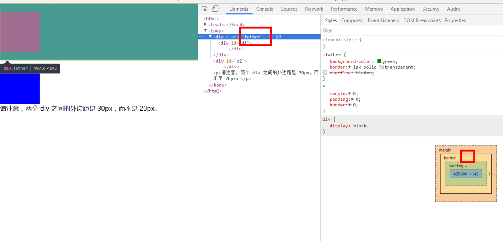
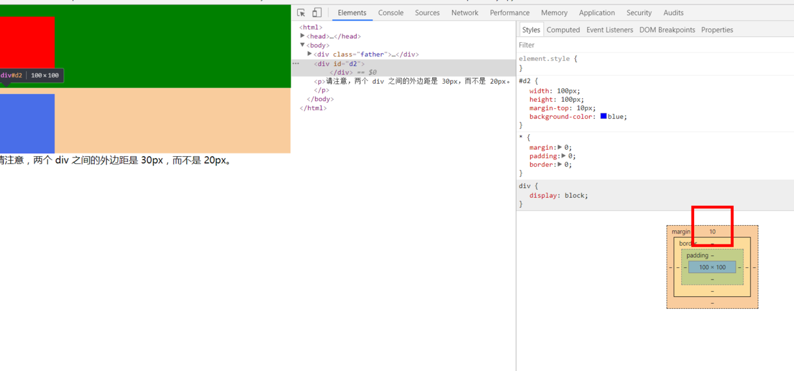

[toc]


> 在父级容器有上下外边距的情况下，子元素如果添加外边距，父元素和子元素的垂直方向上的外边距会合并，相邻元素也会合并。在用margin给子元素和父元素之间留空白的时候通常会发生这样的问题。

几种解决办法：

1. 父容器：border：1px solid;（不能是0px）
2. 父容器：overflow: hidden;（或auto）
3. 父容器：padding：1px；（不能是0或auto，其他的任意数值都可以）
4. 父容器或子容器： float：left；（不能是auto）
5. 父容器或子容器：position：absolute；
6. 子容器：display：inline-block;(或是inline-table)
7. 相邻元素：任意一个添加float：left（不能是auto）


### 1. 通过设置border
> border必须是solid，宽度不能是0px，颜色的话，可以选择为transparent，从而不影响观感。




```html
<html>
    <head>
    <style type="text/css">
    * {
      margin:0;
      padding:0;
      border:0;
    }
    .father{
    background-color:green;
    border:1px  solid transparent; 
    /*overflow: hidden;*/
    }
    
    #d1 {
      width:100px;
      height:100px;
      margin-top:20px;
      margin-bottom:20px;
      background-color:red;
    }
    
    #d2 {
      width:100px;
      height:100px;
      margin-top:10px;
      background-color:blue;
    }
    </style>
    </head>
    <body>
    <div class="father">
    <div id="d1">
    </div>
    </div>
    <div id="d2">
    </div>
    <p>请注意，两个 div 之间的外边距是 30px，而不是 20px。</p>
    </body>
</html>
```

### 2. 通过设置overflow
> overflow只要不为visible，就会创建BFC。一般使用：`overflow:hidden`




```html
<html>
    <head>
    <style type="text/css">
    * {
      margin:0;
      padding:0;
      border:0;
    }
    .father{
    background-color:green;
    overflow:hidden;
    
    }
    
    #d1 {
      width:100px;
      height:100px;
      margin-top:20px;
      margin-bottom:20px;
      background-color:red;
    }
    
    #d2 {
      width:100px;
      height:100px;
      margin-top:10px;
      background-color:blue;
    }
    </style>
    </head>
    <body>
    <div class="father">
    <div id="d1">
    </div>
    </div>
    <div id="d2">
    </div>
    <p>请注意，两个 div 之间的外边距是 30px，而不是 20px。</p>
    </body>
</html>
```